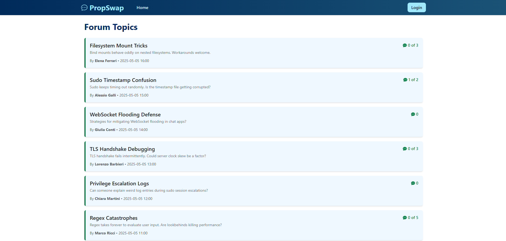

# Exam #1: "Forum"
## Student: s345963 BERTOLAMI CARMELO 

## React Client Application Routes

- Route `/`  
  Home page: displays the list of available forum posts. Accessible to all users, including anonymous visitors.

- Route `/login`  
  Login page for registered users and administrators. If already logged in, the user is redirected to the home page.

- Route `/posts/:id`  
  Single post detail view showing the full post and its related comments.  
  The `:id` parameter identifies the specific post to be displayed.

- Route `/new`  
  Page for creating a new post. Accessible only to authenticated users.

- Route `*`  
  Fallback route: handles unknown paths by redirecting or showing an error page.

## API Server

### Authentication

- **POST `/api/sessions`**  
  *Request Body:* `{ email: string, password: string, otp?: string, adminLogin?: boolean }`  
  *Response:* Logged-in user info with admin status

- **GET `/api/sessions/current`**  
  *Response:* Currently authenticated user information

- **DELETE `/api/sessions/current`**  
  *Response:* Empty object on successful logout

---

### Posts

- **GET `/api/posts`**  
  *Response:* List of all posts

- **GET `/api/posts/:id`**  
  *Params:* `id` – post ID  
  *Response:* Post details with metadata

- **POST `/api/posts`**  
  *Request Body:* `{ title, text, maxComments? }`  
  *Auth Required:* Yes  
  *Response:* Created post

- **DELETE `/api/posts/:id`**  
  *Auth Required:* Yes – must be post author  
  *Response:* 204 No Content

- **DELETE `/api/admin/posts/:id`**  
  *Auth Required:* Yes – admin  
  *Response:* 204 No Content

---

### Comments

- **GET `/api/posts/:postId/comments`**  
  *Params:* `postId`  
  *Response:* List of comments (filtered if user is anonymous)

- **GET `/api/posts/:postId/comments/count`**  
  *Response:* `{ count: number }`

- **POST `/api/posts/:postId/comments`**  
  *Request Body:* `{ text: string }`  
  *Response:* Updated list of comments

- **PUT `/api/comments/:id`**  
  *Auth Required:* Yes – must be author  
  *Request Body:* `{ text: string }`  
  *Response:* 204 No Content

- **PUT `/api/admin/comments/:id`**  
  *Auth Required:* Yes – admin  
  *Response:* 204 No Content

- **DELETE `/api/comments/:id`**  
  *Auth Required:* Yes – must be author  
  *Response:* 204 No Content

- **DELETE `/api/admin/comments/:id`**  
  *Auth Required:* Yes – admin  
  *Response:* 204 No Content

---

### Flags (Interesting Comments)

- **POST `/api/comments/:id/flag`**  
  *Auth Required:* Yes  
  *Response:* `{ message: 'Flag added' }`

- **DELETE `/api/comments/:id/flag`**  
  *Auth Required:* Yes  
  *Response:* 204 No Content

- **GET `/api/users/me/flags`**  
  *Auth Required:* Yes  
  *Response:* List of comment IDs flagged by current user

## Database Tables

### Users

Stores user accounts with credentials and 2FA support.

| Column         | Type      | Description                                 |
|----------------|-----------|---------------------------------------------|
| id             | INTEGER   | Primary key                                 |
| email          | TEXT      | Unique user email                           |
| name           | TEXT      | Full name                                   |
| password_hash  | TEXT      | Secure hash of the password                 |
| salt           | TEXT      | Salt used for hashing                       |
| is_admin       | BOOLEAN   | Indicates admin status (0/1)                |
| totp_secret    | TEXT      | 2FA shared secret for admins                |

---

### Posts

Forum posts created by users.

| Column        | Type      | Description                                  |
|---------------|-----------|----------------------------------------------|
| id            | INTEGER   | Primary key                                  |
| title         | TEXT      | Unique post title                            |
| text          | TEXT      | Post body content                            |
| author_id     | INTEGER   | References Users(id)                         |
| timestamp     | DATETIME  | Creation date (default: current timestamp)   |
| max_comments  | INTEGER   | Optional limit for comments per post         |

---

### Comments

Comments left on posts.

| Column      | Type      | Description                                   |
|-------------|-----------|-----------------------------------------------|
| id          | INTEGER   | Primary key                                   |
| post_id     | INTEGER   | References Posts(id)                          |
| author_id   | INTEGER   | Nullable, references Users(id) or null        |
| text        | TEXT      | Comment content                               |
| timestamp   | DATETIME  | Creation date                                 |
| edited      | BOOLEAN   | Marks if the comment was edited (0/1)         |

---

### InterestingFlags

Users can flag comments as interesting.

| Column      | Type      | Description                                   |
|-------------|-----------|-----------------------------------------------|
| user_id     | INTEGER   | References Users(id)                          |
| comment_id  | INTEGER   | References Comments(id)                       |

Composite primary key: (`user_id`, `comment_id`)

## Main React Components

- **NavbarComponent** (`Navbar.jsx`):  
  Renders the top navigation bar with user login/logout, navigation links, and admin badge.

- **HomePage** (`HomePage.jsx`):  
  Displays the list of all forum posts with navigation to individual post details.

- **PostPage** (`PostPage.jsx`):  
  Shows the full details of a selected post, including its comments, and allows adding new comments.

- **PostDetail** (`PostDetail.jsx`):  
  Displays the content of a single post and handles deletion if the user is the author or an admin.

- **CommentList** (`CommentList.jsx`):  
  Displays all comments of a post, allows flagging, editing, and deleting based on permissions.

- **CommentForm** (`CommentForm.jsx`):  
  Provides the form for adding a new comment to a post, with handling for max comments.

- **LoginForm** (`LoginForm.jsx`):  
  Handles user login with optional 2FA for admin users.

- **NewPostPage** (`NewPostPage.jsx`):  
  Page for creating a new forum post, available only to authenticated users.

- **UserContextProvider** (`UserContext.jsx`):  
  Provides the user context to manage authentication status and access control across components.

## Screenshot

## Users Credentials Admin

- marta.rossi@example.com, sunshine123,  Admin
- giovanni.bianchi@example.com, oceanview7,  Admin
- luca.verdi@example.com, greenleaf9  
- sara.neri@example.com, moonlight8  
- alessio.galli@example.com, starlight5  
- elena.ferrari@example.com, sunflower4  
- marco.ricci@example.com, mountain3,  Admin
- chiara.martini@example.com, violetwind  
- lorenzo.barbieri@example.com, desertsky  
- giulia.conti@example.com, rainfall11,  Admin